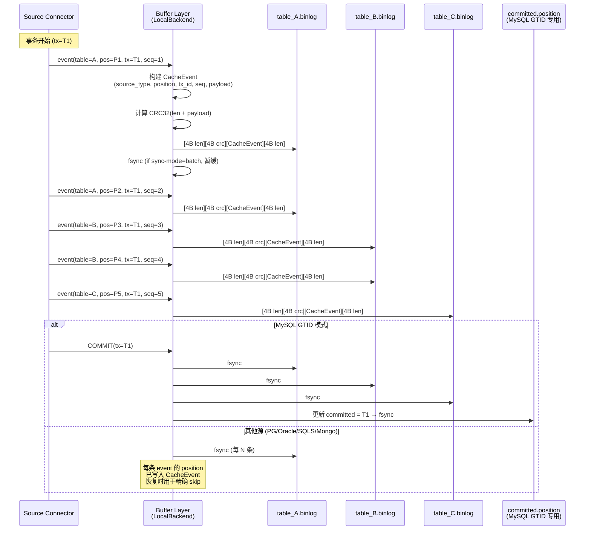
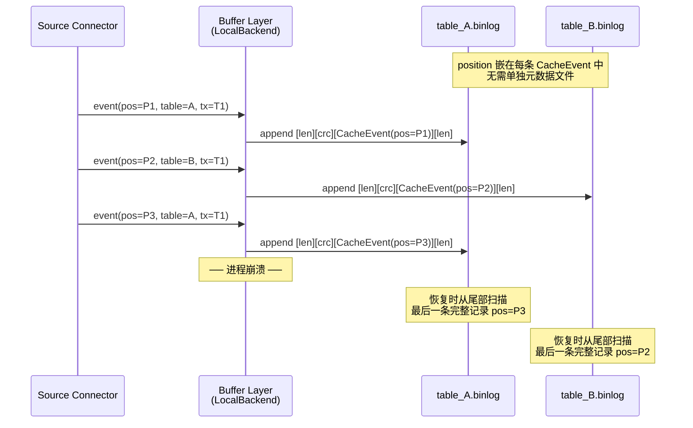
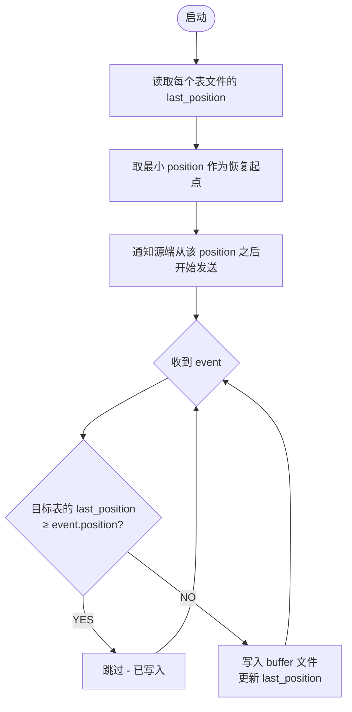
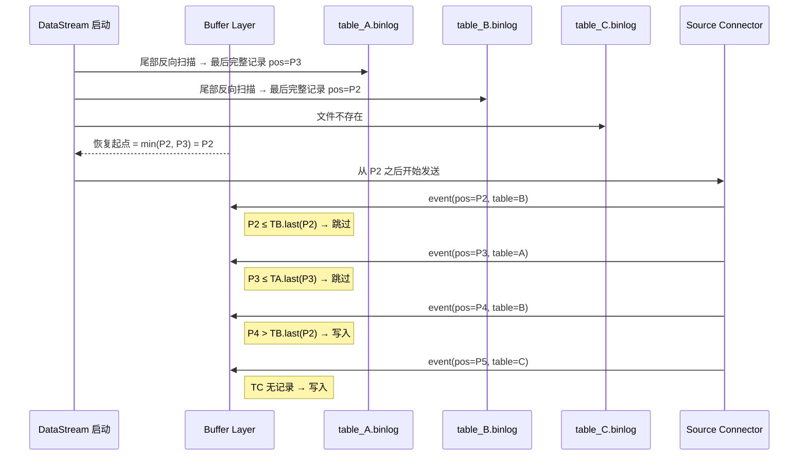
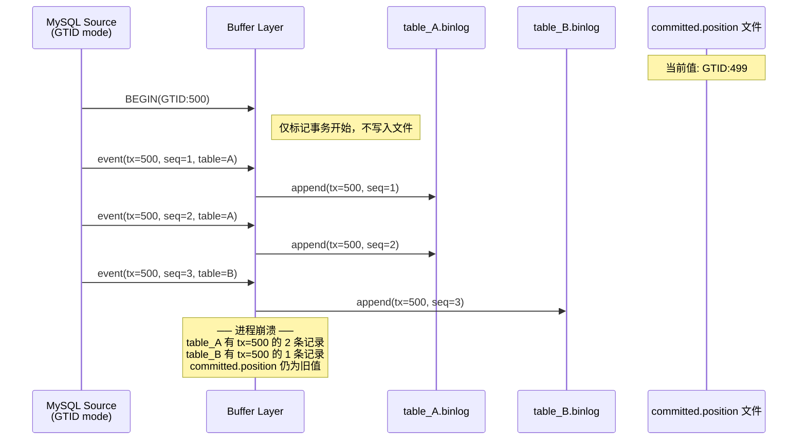
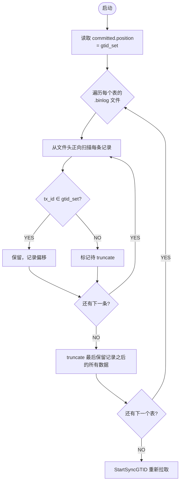
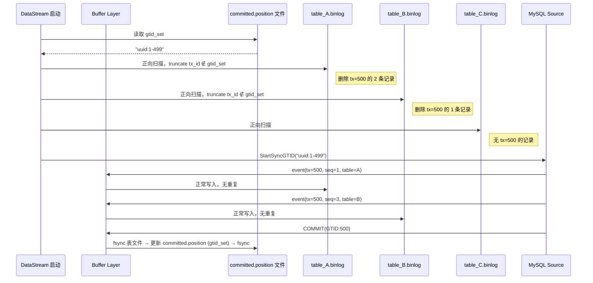
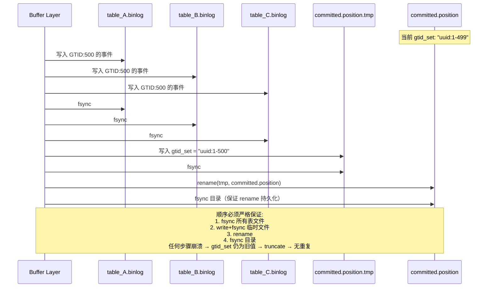
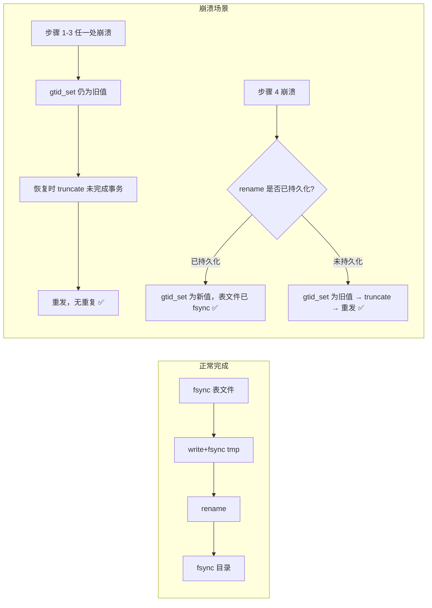
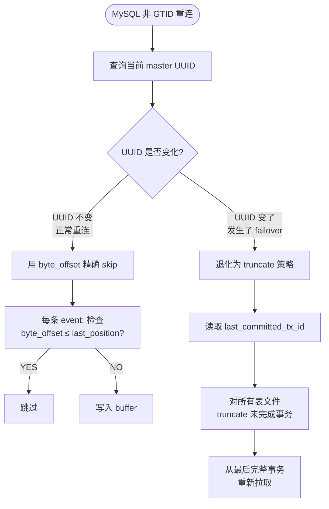

# Schema History + 缓冲文件完整性设计

> 创建时间：2026-05-24
> 状态：**所有决策已完成（D1-D3 已决，D4-D7 已决）**
> 版本：v0.2

---

## 1. 背景

表级独立生命周期特性（`table-lifecycle-design.md`）引入了 binlog 缓冲层（`internal/cache/LocalBackend`），在 snapshotting 阶段将增量事件缓冲到本地文件。当前实现存在两类核心问题：

1. **缓冲文件完整性**：进程中断/崩溃后，缓冲文件可能不完整或包含重复事件
2. **Schema History**：DML 事件解析依赖表结构定义，需要自己维护一份完整的源端表结构历史链，不能依赖源库或目标库实时查询

这两个问题相互关联：缓冲文件存的是序列化的 ChangeEvent，ChangeEvent 的解析需要正确的表结构；表结构的变更（DDL）本身也需要记录在缓冲中并保证完整性。

---

## 2. 缓冲文件完整性

### 2.1 当前问题

通过对 `internal/cache/local_backend.go` 的代码审计，发现以下问题：

| 问题 | 位置 | 严重性 | 说明 |
|------|------|--------|------|
| Write 无 fsync | `local_backend.go:Write()` | P0 | 数据只在内核页面缓存，进程崩溃后可能丢失最后 N 条事件 |
| 部分写入无法检测 | `local_backend.go:Read()` | P0 | 长度前缀写入后载荷截断，Read 静默停止并报告 `CaughtUp=true`（假阳性） |
| Read 错误不传播 | `local_backend.go:Read()` goroutine | P1 | channel 关闭不区分"正常读完"和"遇到损坏记录"，调用方无法区分 |
| 无记录级校验和 | 文件格式 | P1 | 静默数据损坏（位翻转）无法检测，protobuf unmarshal 可能静默返回错误数据 |
| 无幂等写入 | `local_backend.go:Write()` | P2 | 重复写入产生两条相同记录，Read 会重复投递 |
| Route 错误静默丢弃 | `pipeline_integration.go:routeEvents()` | P1 | `_ = p.consumer.Route(...)` 忽略所有错误 |

### 2.2 跨表事务重复问题的根因分析

**核心问题：进程崩溃后重启，源端重发整个事务，导致已写入 buffer 文件的事件被重复写入。**

一个事务的事件分散到多张表的缓冲文件中。写了一半崩溃，重启后源端重发完整事务，已写入的表文件出现重复：

```
事务包含:
  INSERT INTO table_A (id=1)  → 写入 table_A.binlog ✅
  INSERT INTO table_A (id=2)  → 写入 table_A.binlog ✅
  INSERT INTO table_B (id=1)  → 写入 table_B.binlog ✅
  INSERT INTO table_B (id=2)  → 崩溃，未写入 ❌
  INSERT INTO table_C (id=1)  → 崩溃，未写入 ❌

重启后源端重发完整事务:
  table_A: 2 条重复（已有 2 条 + 重发 2 条 = 4 条）
  table_B: 1 条重复（已有 1 条 + 重发 2 条 = 3 条）
  table_C: 正常（0 条 + 重发 1 条 = 1 条）
```

**是否重复取决于两个因素：**

1. **恢复时源端重发的粒度**：整个事务重发 vs 从精确位置继续
2. **buffer 层能否区分已写入和未写入的事件**

### 2.3 各源数据库事件投递与恢复特性

| 源 | Position 格式 | 精度 | 恢复重发粒度 | 跨表重复？ |
|---|---|---|---|---|
| **MySQL GTID** | GTID | 事务级（无事务内子位置） | 整个事务重发，且 master-slave 切换后 binlog file/offset 失效 | **会** |
| **MySQL 非 GTID** | (binlog_file, byte_offset) | 操作级（每条 event 独立 offset） | 从精确 byte_offset 继续；但 master-slave 切换后 file 名变 | **正常重连不会；failover 会** |
| **PostgreSQL** | LSN | 操作级（每条变更独立 LSN） | 从精确 LSN 继续 | **不会** |
| **Oracle** | SCN | 操作级（每条 redo 记录独立 SCN） | 从精确 SCN 继续 | **不会** |
| **SQL Server** | (start_lsn, seqval) | 操作级（start_lsn 事务级 + seqval 操作序号） | 需要 seqval 才能精确恢复 | **取决于 seqval 追踪** |
| **MongoDB** | resume_token | 事件级 | 从精确 token 继续 | **不会** |

**关键发现：**
- PostgreSQL/Oracle/MongoDB 的 position 精度足够，connector 层精确追踪 position 即可避免重复
- MySQL GTID 无法在事务内做精确 skip，必须在 buffer 层做事务级保障
- MySQL 非 GTID 正常重连可用 byte_offset skip，但 failover 后失效
- SQL Server 追踪 `(start_lsn, seqval)` 组合即可精确恢复

### 2.4 设计决策（D1）：按源分治 + 事务标记 truncate

**保持按表分文件存储不变，根据源数据库类型选择不同的恢复策略。**

#### 2.4.1 总体架构

```mermaid
graph TB
    subgraph Source Connectors
        MySQL["MySQL/MariaDB<br/>(GTID / file+pos)"]
        PG["PostgreSQL<br/>(LSN)"]
        Oracle["Oracle<br/>(SCN)"]
        SQLS["SQL Server<br/>(lsn+seqval)"]
        Mongo["MongoDB<br/>(resume_token)"]
    end

    subgraph Buffer Layer - LocalBackend
        direction TB
        TA["table_A.binlog<br/>[4B len][4B CRC32][CacheEvent][4B len]"]
        TB2["table_B.binlog<br/>[4B len][4B CRC32][CacheEvent][4B len]"]
        TC["table_C.binlog<br/>[4B len][4B CRC32][CacheEvent][4B len]"]
    end

    subgraph Metadata
        M1["per-table 文件尾部记录<br/>position 与数据原子写入<br/>(PG/Oracle/Mongo/SQLS/MySQL非GTID)"]
        M2["committed.position 文件<br/>write-then-rename + 目录 fsync<br/>(MySQL GTID 专用，存完整 gtid_set)"]
        M3["master_uuid<br/>(MySQL 非 GTID failover 检测)"]
    end

    subgraph Recovery Layer
        R1["精确 Position Skip"]
        R2["事务标记 Truncate"]
    end

    MySQL -->|event + position| Buffer Layer
    PG -->|event + position| Buffer Layer
    Oracle -->|event + position| Buffer Layer
    SQLS -->|event + position| Buffer Layer
    Mongo -->|event + position| Buffer Layer

    Buffer Layer --> M1
    Buffer Layer --> M2
    Buffer Layer --> M3

    M1 --> R1
    M2 --> R2
    M3 --> R1

    R1 -.->|"启动时: PG/Oracle/Mongo/SQLS/<br/>MySQL非GTID正常重连"| Buffer Layer
    R2 -.->|"启动时: MySQL GTID /<br/>MySQL非GTID failover"| Buffer Layer
```

#### 2.4.2 完整写入流程（跨表事务）

以下展示一个跨 3 张表的事务从源端到 buffer 文件的完整写入流程：



#### 2.4.3 恢复策略一：精确 Position Skip（PG / Oracle / MongoDB / SQL Server / MySQL 非 GTID）

适用于 position 精度为操作级的源。

**Position 比较规则（按源类型分派）：**

当前 `Position.Compare()` 只比较 CommitTime + SeqNo，不可靠。必须按 source_type 分派：

| 源 | 比较字段 | 说明 |
|---|---|---|
| **PostgreSQL** | `LSN` | uint64 直接比较 |
| **Oracle** | `SCN` | uint64 直接比较 |
| **SQL Server** | `(ChangeLsn, SeqVal)` | 先比较 ChangeLsn，再比较 SeqVal |
| **MySQL 非 GTID** | `(BinlogFile, BinlogPos)` | 先按文件名排序，再比较 offset |
| **MongoDB** | resume_token | 不做客户端比较，用 `SetResumeAfter()` 恢复 |

```go
// Compare 按源类型分派 position 比较。
// 仅适用于精确 position skip 的源（PG/Oracle/SQLServer/MySQL非GTID）。
// MySQL GTID 模式不使用此方法——恢复时用 gtid_set 成员判断（tx_id ∈ committed_set）。
// MongoDB 不使用此方法——恢复时用 SetResumeAfter(token)。
func (p *Position) Compare(other *Position, sourceType SourceType) (int, error) {
    switch sourceType {
    case SourceTypePostgres:
        return compareUint64(p.LSN, other.LSN), nil
    case SourceTypeOracle:
        return compareUint64(p.SCN, other.SCN), nil
    case SourceTypeSQLServer:
        if c := strings.Compare(p.ChangeLsn, other.ChangeLsn); c != 0 {
            return c, nil
        }
        return strings.Compare(p.SeqVal, other.SeqVal), nil
    case SourceTypeMySQLFilePos:
        if c := strings.Compare(p.BinlogFile, other.BinlogFile); c != 0 {
            return c, nil
        }
        return compareUint64(uint64(p.BinlogPos), uint64(other.BinlogPos)), nil
    case SourceTypeMySQLGTID:
        // MySQL GTID 恢复走 committed.position gtid_set 成员判断，不走 position 比较。
        // 调用方应使用 gtid_set.Contains(tx_id) 而非 Compare()。
        return 0, fmt.Errorf("MySQL GTID mode does not use Compare(); use gtid_set membership instead")
    case SourceTypeMongoDB:
        // MongoDB resume_token 是不透明 BSON，不做客户端大小比较。
        // 恢复时直接用 SetResumeAfter(token)。
        return 0, fmt.Errorf("MongoDB does not use Compare(); use SetResumeAfter() instead")
    default:
        return 0, fmt.Errorf("unsupported source type for comparison: %v", sourceType)
    }
}
```

**Compare() 使用范围说明：**

| 源 | 是否使用 Compare() | 恢复方式 |
|---|---|---|
| PostgreSQL | ✅ | LSN skip |
| Oracle | ✅ | SCN skip |
| SQL Server | ✅ | (lsn, seqval) skip |
| MySQL 非 GTID | ✅ | byte_offset skip / failover 时 truncate |
| MySQL GTID | ❌ | gtid_set 成员判断 + truncate |
| MongoDB | ❌ | SetResumeAfter() |

**写入时序图：**



**恢复流程图：**



**注意：min position 计算必须覆盖 connector 正在追踪的所有表，不仅是已有 buffer 文件的表。** 没有 buffer 文件的表，其有效 last_position 为 connector 的初始启动位点（"beginning of time"）。如果只取已有文件的 min，那些表会永久丢失初始位点到 min 之间的事件。

实现方式：connector 启动时将初始位点持久化到 `meta/start_position` 文件。恢复时 `global_min = min(start_position, 各表文件尾部 position)`。

**恢复时序图：**



**元数据存储：不需要单独的元数据文件。**

每条 CacheEvent 已经包含 position，恢复时直接从 buffer 文件本身提取 last_position：

```
恢复时：
1. 读 table_A.binlog 文件
2. 从尾部反向扫描（利用尾部 4B length 字段），找到最后一条完整记录（首尾 length 一致 + CRC32 校验通过）
3. 该记录的 position 即为 last_position
4. 从该 position 之后重新拉取
```

这样 position 与数据原子写入（同一笔 len+CRC32+payload+len 全部落盘才算有效），不存在"写了数据没写 position"的不一致问题。半写入的记录尾部 length 缺失或 CRC32 校验失败，直接 truncate。

#### 2.4.4 恢复策略二：事务标记 Truncate（MySQL GTID）

GTID 模式下 position 是事务级，无法在事务内做精确 skip。采用事务标记 + 元数据 + truncate 方案。

**写入时序图：**



**恢复流程图：**



**注意：并发事务导致 tx_id 可能交错（如 tx=499, tx=500, tx=499），必须正向扫描处理全部记录，不能反向扫描提前终止。**

**恢复时序图：**



使用 write-then-rename 原子更新：



**崩溃场景分析：**



**committed.position 文件格式：**

存储完整 executed GTID set（不是单个 GTID），因为 MySQL `StartSyncGTID()` 需要完整 set：

```
meta/committed.position:
  source_type: mysql_gtids
  gtid_set: "3E11FA47-71CA-11E1-9E33-C80AA9429562:1-500"
  updated_at: 2026-06-02T10:30:00Z
  checksum: CRC32
```

每次事务提交后，将新 GTID merge 到 set 中（如 `:500` → `:1-500`）。

**注意：当前代码使用 `syncer.StartSync(mysql.Position{})` (file+pos 模式)，GTID 路径需要改用 `syncer.StartSyncGTID(gtidSet)`。**

#### 2.4.5 MySQL 非 GTID + Failover 混合场景

MySQL 非 GTID 模式下：
- **正常重连**：用 byte_offset skip（精确到 event 级别，无重复）
- **Failover**：byte_offset 失效，退化为事务级问题

处理方式：
1. 追踪 master UUID（`SELECT @@server_uuid`）
2. 正常重连（UUID 不变）→ byte_offset skip
3. Failover（UUID 变了）→ 检测到 master 切换 → 退化为 truncate 策略

**MySQL 非 GTID 的 tx_id 定义：**

非 GTID 模式没有全局事务标识。CacheEvent.tx_id 使用合成标识：

```go
// 合成 tx_id = binlog_file + BEGIN 事件的 byte_offset
// 同一事务内的所有 event 共享同一 tx_id
tx_id = fmt.Sprintf("%s:%d", binlogFile, beginEventOffset)
```

这个 tx_id 在同一 binlog server 内唯一。Failover 后 binlog file 名变了，旧 tx_id 与新 server 的 tx_id 不会冲突。

**Failover 恢复流程：**
1. 检测 master_uuid 变化
2. 对所有表文件正向扫描，记录出现过的 tx_id 集合
3. 找到文件中最后一个 `is_commit=true` 的记录，其 tx_id 之前的事务视为完整
4. truncate 该 tx_id 之后的所有记录
5. 从该 byte_offset + 1 重新拉取（注意：failover 后 byte_offset 失效，需要从新 master 的当前位点开始，接受可能的少量重复或丢失——这是非 GTID 模式的固有限制）

**推荐：生产环境始终启用 GTID 模式。**



#### 2.4.6 SQL Server 特殊处理

SQL Server CDC 的 position 由 `(start_lsn, seqval)` 组成：
- `start_lsn`：事务级（事务起始 LSN）
- `seqval`：事务内操作序号

当前实现只追踪 `start_lsn`，需要补充 `seqval` 追踪。

```go
// 当前: 只有 ChangeLsn (start_lsn)
Position{ChangeLsn: "0x00000025:000001D8:0001"}

// 改为: 追踪完整位置
Position{
    ChangeLsn:  "0x00000025:000001D8:0001",  // start_lsn
    SeqVal:     "0x00000025:000001D8:0002",  // seqval (操作序号)
}
```

恢复时用 `(start_lsn, seqval)` 做精确 skip，与 PostgreSQL LSN skip 逻辑相同。

#### 2.4.7 各源恢复策略汇总

| 源 | 写入时标记 | 恢复策略 | 元数据 |
|---|---|---|---|
| **MySQL GTID** | tx_id + event_seq | 事务标记 truncate | committed.position 文件（存完整 gtid_set，write-then-rename + 目录 fsync） |
| **MySQL 非 GTID** | byte_offset + master_uuid | byte_offset skip / failover 时 truncate | per-table 文件尾部记录 + master_uuid |
| **PostgreSQL** | LSN | LSN skip | per-table 文件尾部记录（无需额外元数据） |
| **Oracle** | SCN | SCN skip | per-table 文件尾部记录（无需额外元数据） |
| **SQL Server** | (start_lsn, seqval) | (lsn, seqval) skip | per-table 文件尾部记录（无需额外元数据） |
| **MongoDB** | resume_token | 用 SetResumeAfter() 恢复，无需客户端 skip | per-table 文件尾部记录（无需额外元数据） |

### 2.5 CacheEvent 格式改造

当前 `CacheEvent` 使用 MySQL GTID 专用字段。改为通用格式：

```protobuf
// 当前 (MySQL 专用)
message CacheEvent {
    string gtid = 1;
    int64  event_seq = 2;
    bool   is_begin = 3;
    bool   is_commit = 4;
    bytes  payload = 5;
    int64  timestamp_ms = 6;
}

// 改为 (通用)
message CacheEvent {
    // 源类型标识
    SourceType source_type = 1;    // mysql_gtids / mysql_filepos / postgres / oracle / sqlserver / mongo

    // 通用 position (序列化的 event.Position JSON)
    bytes position = 2;

    // 事务标识 (源特定)
    string tx_id = 3;              // MySQL: GTID / file:offset hash; PG: xid; Oracle: XID; SQLServer: start_lsn

    // 事务内序号
    int64 event_seq = 4;

    // 事务边界
    bool is_begin = 5;
    bool is_commit = 6;

    // 事件负载
    bytes payload = 7;

    // 写入时间
    int64 timestamp_ms = 8;

    // MySQL 非 GTID 专用: byte_offset 用于精确 skip
    uint64 byte_offset = 9;

    // SQL Server 专用: seqval 用于精确 skip
    string seq_val = 10;
}

enum SourceType {
    SOURCE_TYPE_UNSPECIFIED = 0;
    SOURCE_TYPE_MYSQL_GTID = 1;
    SOURCE_TYPE_MYSQL_FILEPOS = 2;
    SOURCE_TYPE_POSTGRES = 3;
    SOURCE_TYPE_ORACLE = 4;
    SOURCE_TYPE_SQLSERVER = 5;
    SOURCE_TYPE_MONGODB = 6;
}
```

**兼容性说明（Breaking Change）：**

CacheEvent 从 6 字段扩展到 10 字段，wire format 不兼容。旧的 buffer 文件在新代码下无法反序列化。

处理方式：**开发阶段直接废弃旧 buffer 文件，不写兼容代码。** 启动时如果检测到旧格式文件（通过字段数量或 record 长度异常判断），直接删除并从源端重新拉取。

### 2.6 文件格式改造

当前格式：`[4B length][N bytes protobuf]`

改为：`[4B length][4B CRC32][N bytes protobuf][4B length]`

```
┌──────────┬──────────┬──────────────────┬──────────┐
│ 4B len   │ 4B CRC32 │ N bytes payload  │ 4B len   │
│ (BE)     │ (len+pb) │ (CacheEvent pb)  │ (BE,重复)│
└──────────┴──────────┴──────────────────┴──────────┘
```

- CRC32 覆盖 `length_bytes || payload`（即前 4B + 中间 N B），length 字段损坏时立即检测
- 尾部重复 length 字段，支持从文件尾部反向扫描：读最后 4B → 得到 record size → seek 回 record 起始 → 校验 CRC32
- Read 时校验 CRC32，不匹配则记录错误并传播给调用方（不再静默 CaughtUp=true）
- **最大记录长度校验**：读取 length 后检查 ≤ 可配置上限（默认 64MB），超限视为损坏记录

### 2.7 Write 安全保障

#### fsync 策略

```go
type SyncMode string

const (
    SyncModeEvery SyncMode = "every"   // 每条 event 写入后 fsync
    SyncModeBatch SyncMode = "batch"   // 每 N 条或每事务 fsync
    SyncModeNone  SyncMode = "none"    // 不主动 fsync（依赖 OS）
)
```

推荐配置：
- **MySQL GTID 模式**：`batch`（每事务 COMMIT 时 fsync，因为 committed.position 更新依赖表文件 fsync）
- **其他源**：`batch`（每 N 条 fsync，平衡性能与安全）
- **开发/测试**：`none`

#### 部分写入检测

启动时利用尾部 length 字段反向扫描每个表文件：

1. seek 到文件末尾 - 4B → 读取尾部 length（= payload 大小 N）
2. 校验 N ≤ 最大记录长度（默认 64MB），否则视为损坏
3. seek 回 `file_size - N - 12`（= 记录起始位置）→ 读取完整记录（首部 len + CRC32 + payload + 尾部 len）
4. 校验首尾 length 一致 → 校验 CRC32(len_bytes || payload)
5. 不匹配 → truncate（`file_size = file_size - N - 12`）→ 回到步骤 1
6. 匹配 → 最后一条完整记录，提取 position 作为 last_position

#### Read 错误传播

```go
// ReadResult 包含事件流和错误流
type ReadResult struct {
    Events <-chan *CacheEvent  // 正常事件流
    Err    <-chan error         // 至多一个致命错误（CRC 校验失败、IO 错误等）
}

// 契约:
// - 正常结束: Events 和 Err 都关闭，Err 无值
// - 遇到错误: 发送一个 error 到 Err，然后关闭 Events 和 Err
// - context 取消: 关闭 Events 和 Err，Err 无值
// - 消费者必须同时 select Events 和 Err
```

**接口变更说明（Breaking Change）：**

当前 `BinlogCacheBackend.Read()` 返回 `<-chan *CacheEvent`（定义于 `table-lifecycle-design.md` §3.3）。改为返回 `ReadResult` 是破坏性变更。

处理方式：**开发阶段直接废弃旧接口，不写兼容层。** 同步更新所有调用方：
- `CatchingUpReplayer` — 改为消费 `ReadResult.Events` + `ReadResult.Err`
- 所有测试中的 Read 调用

### 2.8 Route 错误处理

`pipeline_integration.go` 中 `routeEvents()` 当前静默丢弃 Route 错误：

```go
// 当前
_ = p.consumer.Route(...)

// 改为
if err := p.consumer.Route(...); err != nil {
    p.metrics.RouteErrors.Inc()
    log.Error("route event failed", zap.Error(err))
    // 可选: 重试 or 写入死信队列
}
```

### 2.9 方案选定后的影响

**事务级完整性保证后，`table-lifecycle-design.md` 中的 catching_up UPSERT 安全窗口（§6.2）可以删掉或降级为可选防御性配置（默认关闭）。**

因为：
- MySQL GTID 模式：committed.position gtid_set 精确标记最后完整事务，无重叠区
- 其他源：position 精确 skip，无重叠区
- 不需要"前 1 分钟 UPSERT"来覆盖重叠

### 2.10 其他完整性修复清单

| 修复项 | 优先级 | 说明 |
|--------|--------|------|
| **CacheEvent 格式通用化** | P0 | 新增 source_type / position / tx_id / byte_offset / seq_val |
| **文件格式加 CRC32** | P0 | `[4B length][4B CRC32][N bytes protobuf][4B length]` |
| **Write 后 fsync** | P0 | 可配置 sync-mode |
| **Read 错误传播** | P0 | 独立 error channel |
| **部分写入检测 + truncate** | P0 | 启动时校验文件尾部记录完整性 |
| **committed.position 元数据** | P0 | MySQL GTID 模式专用，write-then-rename 原子更新 |
| **master_uuid 追踪** | P1 | MySQL 非 GTID failover 检测 |
| **SQL Server seqval 追踪** | P1 | 补充 seqval 到 Position |
| **Route 错误处理** | P1 | 不再静默丢弃 |

---

## 3. Schema History

### 3.1 为什么需要

CDC 增量同步中，DML 事件（INSERT/UPDATE/DELETE）的行数据是按列位置排列的原始值。要正确解析这些值，需要知道**当时那个时刻的表结构**（列名、类型、位置顺序）。

当前实现的做法是从源库的 `INFORMATION_SCHEMA` 实时查询表结构（`internal/source/mysql/schema_cache.go`），但这有两个根本性问题：

**问题 1：时序不匹配**

DML 事件对应的是历史时刻的表结构。如果 T1 时刻表有 3 列，T2 时刻 ALTER 加了第 4 列，T3 时刻查 `INFORMATION_SCHEMA` 拿到 4 列——但 T1 的 DML 只有 3 个值。列数对不上。

```
T1: INSERT INTO t (a,b,c) VALUES (1,2,3)     ← 3 列
T2: ALTER TABLE t ADD COLUMN d INT            ← 表变成 4 列
T3: 查 INFORMATION_SCHEMA → 拿到 4 列        ← 用 4 列 schema 解析 3 列数据 → 错误
```

**问题 2：跨数据库不可用**

跨库场景（MySQL→Oracle、PostgreSQL→MySQL），查目标库的 `INFORMATION_SCHEMA` 拿到的是目标端类型（如 Oracle 的 `VARCHAR2`），不是源端 binlog 需要的类型（MySQL 的 `VARCHAR`）。

**各源 DML 解析对 Schema History 的依赖程度不同：**

| 源 | DML 格式 | 是否需要 Schema History | 说明 |
|---|---|---|---|
| **MySQL / MariaDB** | Binlog Row Event（按列位置排列的原始值） | **必须** | 行数据无列名，必须用表结构还原 |
| **PostgreSQL** | Logical Replication Message（按列位置） | **必须** | 同 MySQL |
| **SQL Server** | CDC 变更行（按列位置） | **必须** | 同 MySQL |
| **Oracle** | LogMiner SQL_REDO（自描述 SQL 文本） | **不需要** | SQL_REDO 包含列名和值（如 `INSERT INTO t(a,b) VALUES(1,2)`），Parser 直接解析文本，不依赖表结构。参见 `oracle-dml-parser-design.md` §4.2 |
| **MongoDB** | Change Stream JSON（自描述） | **不需要** | 文档数据库天然自描述 |

### 3.2 Debezium 的做法（参考实现）

Debezium 维护一条 **Schema History 链**，每个 DDL 事件点都存一份完整的表结构快照：

```
Debezium Schema History:
  Position:BinlogFile=mysql-bin.000001,Pos=4
    → CREATE TABLE t (a INT, b VARCHAR(100))       → 存完整 Table{Columns:[a,b]}
  
  Position:BinlogFile=mysql-bin.000001,Pos=1234
    → ALTER TABLE t ADD COLUMN c TIMESTAMP          → 存完整 Table{Columns:[a,b,c]}
  
  Position:BinlogFile=mysql-bin.000002,Pos=567
    → ALTER TABLE t DROP COLUMN b                   → 存完整 Table{Columns:[a,c]}
```

关键代码路径（证据来源 `~/Codes/dts/debezium/`）：

- `HistoryRecord`（`debezium-core/.../history/HistoryRecord.java`）：每条记录包含 source position + DDL 文本 + 序列化的完整 TableChanges
- `JsonTableChangeSerializer`：序列化每列的 name、jdbcType、typeName、length、scale、position、nullable、autoIncremented、defaultValueExpression 等
- `AbstractSchemaHistory.recover()`：重启时按顺序读取所有 HistoryRecord，position ≤ connector offset 的 apply 到内存 Tables
- `RelationalChangeRecordEmitter`：DML 处理时列名/类型/位置**全部来自内存中的 TableSchema**，不查源库

存储后端默认是 Kafka topic（`KafkaSchemaHistory`），retention = 无限。

### 3.3 DataStream 的设计

#### Parser 接口

Parser 不只产出 delta，直接负责合成新的完整 TableInfo。`ApplyDDL` 作为 `DDLParser` 接口的新增方法，现有 `Parse()` 方法保持不变：

```go
// DDLParser 接口扩展（现有 Parse 方法不变，新增 ApplyDDL）
type DDLParser interface {
    // 现有方法 — 不改动
    Parse(ctx context.Context, ddl string) ([]*DDLResult, error)
    SupportedTypes() []DDLType

    // 新增方法 — B1 实现
    // ApplyDDL 解析 DDL 并基于旧表结构产出完整的新表结构
    // oldTable: CREATE 时为 nil，ALTER 时传入旧结构
    // 返回: DDLResult 包含 delta（供过滤/映射用）+ 新的完整 TableInfo（供 Schema History 存储）
    ApplyDDL(ctx context.Context, oldTable *event.TableInfo, ddl string) (*DDLResult, error)
}

type DDLResult struct {
    Type         DDLType           // CREATE / ALTER / DROP
    Database     string
    Table        string

    // delta — 下游 DDL 过滤/表名映射/路由决策用
    TableChanges *TableChanges     // AddedColumns, DroppedColumns, ModifiedColumns

    // 完整结果 — Schema History 存储用
    NewTableInfo *event.TableInfo  // ALTER/CREATE 后的完整表结构；DROP 时 nil
}
```

- **CREATE**：`oldTable = nil`，parser 从 DDL 构建完整 TableInfo
- **ALTER**：`oldTable` 传入当前内存中的旧结构，parser 解析 delta 后应用到旧结构上产出新 TableInfo
- **DROP**：`NewTableInfo = nil`

为什么由 Parser 合成而非外部 `Tables.Apply()`：
- Parser 理解 SQL 语义（`AFTER col_name`、`CHANGE old new type`），这些是 SQL 解析器的专业领域
- `Tables` 只是数据结构容器，不应该理解 SQL 语法

#### DDL 应用状态跟踪

DDL 到目标端执行是异步的（可能耗时很长，比如大表加索引），需要跟踪状态：

```go
type DDLRecord struct {
    // 来源
    Position     *event.Position
    Database     string
    Table        string
    DDL          string               // 原始 DDL 语句

    // Parser 产出
    Result       *DDLResult           // delta + NewTableInfo

    // 应用状态
    Status       DDLStatus
    AppliedAt    *time.Time           // 开始执行时间
    CompletedAt  *time.Time           // 执行完成时间
    Error        string               // 失败原因
    RetryCount   int
}

type DDLStatus string

const (
    DDLStatusPending   DDLStatus = "pending"    // 已解析，未发到目标端
    DDLStatusApplying  DDLStatus = "applying"   // 目标端执行中
    DDLStatusCompleted DDLStatus = "completed"  // 目标端执行成功
    DDLStatusFailed    DDLStatus = "failed"     // 目标端执行失败
    DDLStatusSkipped   DDLStatus = "skipped"    // 被 DDL 过滤规则跳过
)
```

#### 核心流程（修正版）

**关键原则：目标端 DDL 执行成功后才更新内存 Tables 和 Schema History。**

```
1. DDL binlog event 到达
2. parser.ApplyDDL(oldTableInfo, ddl) → DDLResult (delta + NewTableInfo)
3. 记录 DDLRecord (status = pending)
4. Pipeline DDL 过滤/映射决策（基于 delta）
   ├── 被过滤跳过 → status = skipped → 流程结束（Tables 不变）
   └── 通过 → 继续
5. 发到目标端执行 (status = applying)
6a. 执行成功:
    → status = completed
    → Tables.Put(NewTableInfo)              ← 此刻才更新内存
    → SchemaHistory.Record(position, NewTableInfo) ← 此刻才持久化
    → 后续 DML 使用新 schema
6b. 执行失败:
    → status = failed
    → Tables 不变（保持旧 schema）
    → 该表进入 error 状态，暂停增量事件处理
    → 等待人工介入（修复后 retry 或 skip）
```

**DDL 失败后的行为：**
- 内存 Tables 停留在旧版本
- 源端后续 DML 使用新列结构但 Tables 里是旧结构 → 列数不匹配 → 自然触发解析错误
- 表进入 error 状态，等待运维处理
- 运维选项：手动修复目标端 schema 后 retry DDL / 跳过该 DDL 并手动同步 schema

#### SchemaHistoryRecord

```go
type SchemaHistoryRecord struct {
    Position     event.Position
    Database     string
    Schema       string              // PostgreSQL/Oracle 的 schema
    Table        string
    DDL          string              // 原始 DDL 语句
    TableInfo    *event.TableInfo    // 目标端执行成功后的完整表结构（DROP 时 nil）
    ChangeType   string              // "CREATE" / "ALTER" / "DROP"
    DDLStatus    DDLStatus           // completed / skipped
    Timestamp    time.Time
}
```

**注意：只有 `completed` 和 `skipped` 状态的 DDL 才会写入 Schema History。`pending`/`applying`/`failed` 不写入——因为表结构实际上没变。**

#### SchemaHistory 接口

```go
type SchemaHistory interface {
    Record(ctx context.Context, record *SchemaHistoryRecord) error
    Recover(ctx context.Context, tables *Tables, offset *event.Position) error
    Exists(ctx context.Context) (bool, error)
    Close() error
}
```

#### Tables（内存表定义集合）

```go
type Tables struct {
    tables map[string]*event.TableInfo  // "database.table" → TableInfo
    mu     sync.RWMutex
}

func (t *Tables) Put(info *event.TableInfo)
func (t *Tables) Get(database, table string) *event.TableInfo
func (t *Tables) Remove(database, table string)
```

注意：`Apply()` 方法不再需要——合成逻辑由 Parser 的 `ApplyDDL()` 完成。Tables 只是一个纯存储容器。

#### 初始 Schema 来源

- **全量同步阶段**：从源库 `INFORMATION_SCHEMA` 查询（snapshot 时刻精准快照），作为第一批 CREATE 记录写入 history
- **增量阶段遇到 Tables 里没有的表**：从源库查询（安全的，因为还没有该表的 DDL 在 history 中）
- 类比 Debezium 的 `schema_only_recovery` 模式

### 3.4 DML 事件处理改造

当前（`internal/source/mysql/binlog_syncer.go`）：

```go
tableInfo, err := s.schemaCache.Get(s.ctx, database, table)  // 查 INFORMATION_SCHEMA
```

改为：

```go
tableInfo := s.tables.Get(database, table)  // 从 schema history 恢复的内存 Tables
```

---

## 4. Parser ALTER 解析增强

### 4.1 当前状态

通过代码审计（`pkg/parser/*/visitor.go`），4 个 parser 的 ALTER TABLE 产出质量如下：

| Parser | 列名 | 类型 | Nullable | 位置变更 | Default | 解析方式 |
|--------|------|------|----------|---------|---------|---------|
| MySQL | ✅ | 部分（`GetText()` 原始文本） | ❌ | ❌ 不处理 `AFTER`/`FIRST` | ❌ | ANTLR AST |
| Oracle | ✅ | ❌ | ❌ | ❌ | ❌ | **文本匹配**（不可靠） |
| PostgreSQL | ✅ | ❌ | ❌ | N/A（PG 不支持列位置） | ❌ | ANTLR AST |
| SQL Server | ✅ | ❌ | ❌ | N/A | ❌ | ANTLR AST |

### 4.2 ALTER delta 需要产出的完整信息

```go
type AlterColumnChange struct {
    Operation   AlterColumnOp  // ADD / MODIFY / CHANGE / DROP / RENAME
    OldName     string         // CHANGE/RENAME 时的旧列名
    NewName     string         // 列名（CHANGE/RENAME 时为新列名）
    Type        string         // 完整类型定义: "VARCHAR(255)", "INT UNSIGNED", "DECIMAL(10,2)"
    Nullable    *bool          // nil = 未指定
    Position    *ColumnPosition // MySQL: AFTER col_name / FIRST; 其他 DB: nil
    Default     *string        // DEFAULT 值; nil = 未指定
}

type ColumnPosition struct {
    First bool   // FIRST 关键字
    After string // AFTER column_name
}
```

### 4.3 各 Parser 需要增强的具体内容

#### MySQL

| 待修复 | 说明 | 当前代码位置 |
|--------|------|------------|
| `VisitAlterByChangeColumn` 未实现 | `CHANGE old_col new_col type` 同时改名+改类型 | `mysql/visitor.go` |
| `AFTER`/`FIRST` 位置不处理 | `MODIFY col INT AFTER another_col` 的位置指令被忽略 | `mysql/visitor.go:VisitAlterByModifyColumn` |
| 类型提取不完整 | `GetText()` 拿的是原始文本，需要解析为结构化类型 | `mysql/visitor.go:305-341` |
| Nullable 不提取 | `NOT NULL` / `NULL` 约束未解析 | — |
| Default 不提取 | `DEFAULT value` 未解析 | — |

MySQL 特有的 `CHANGE` 语法示例：
```sql
ALTER TABLE t CHANGE old_col new_col INT NOT NULL DEFAULT 0 AFTER another_col;
-- 一条语句同时：改名 + 改类型 + 改 nullable + 改默认值 + 改位置
```

#### Oracle

| 待修复 | 说明 |
|--------|------|
| 整个 ALTER 解析用文本匹配 | `strings.Contains(upperText, "ADD")` 不可靠，需要重写为 ANTLR visitor |
| 列类型不提取 | 只提取列名 |
| 不支持 `MODIFY` 语法完整解析 | Oracle 的 `MODIFY column datatype` |

#### PostgreSQL

| 待修复 | 说明 |
|--------|------|
| 列类型不提取 | `ADD COLUMN col type` 只提取了 col 名 |
| `ALTER COLUMN ... TYPE` 不处理 | 类型变更未解析 |
| `SET NOT NULL` / `DROP NOT NULL` 不处理 | — |
| `SET DEFAULT` / `DROP DEFAULT` 不处理 | — |

#### SQL Server

| 待修复 | 说明 |
|--------|------|
| `ALTER COLUMN` 不处理 | 类型变更未解析 |
| 列类型不提取 | 同 PostgreSQL |

### 4.4 列位置处理（Parser 内部实现）

MySQL 支持通过 ALTER TABLE 改变列的物理位置，这影响 binlog 中行数据的列顺序。

```sql
CREATE TABLE t (a INT, b INT, c INT);
-- binlog 行数据: [a_val, b_val, c_val]

ALTER TABLE t MODIFY b INT FIRST;
-- 表变为: b INT, a INT, c INT
-- binlog 行数据: [b_val, a_val, c_val]  ← 列顺序变了！
```

列位置处理在 `parser.ApplyDDL()` 内部完成——parser 拿到旧 TableInfo 和 DDL，解析出位置指令后重排列数组，产出新 TableInfo。外部调用方不感知位置变更的细节。

```
Parser.ApplyDDL(oldTable{Columns:[a,b,c]}, "ALTER TABLE t MODIFY b INT FIRST")
→ DDLResult{
    TableChanges: {ModifiedColumns: [{Name:"b", Position:{First:true}}]}
    NewTableInfo: {Columns:[b,a,c]}  ← 列顺序已重排
  }
```

---

## 5. 文件影响清单

| 文件 | 操作 | 说明 |
|------|------|------|
| `pkg/event/schema_history.go` | 新增 | SchemaHistoryRecord + SchemaHistory 接口 + DDLRecord + DDLStatus |
| `internal/schema/tables.go` | 新增 | Tables 内存表集合（纯存储容器，无 Apply 逻辑） |
| `internal/schema/local_history.go` | 新增 | LocalSchemaHistory 存储实现 |
| `internal/schema/tables_test.go` | 新增 | Put/Get/Remove 测试 |
| `internal/schema/local_history_test.go` | 新增 | Record + Recover 测试 |
| `pkg/parser/parser.go` (或接口文件) | 修改 | `DDLParser` 接口新增 `ApplyDDL(ctx, oldTable, ddl) → DDLResult` 方法（现有 `Parse()` 不动） |
| `pkg/parser/mysql/visitor.go` | 修改 | ALTER 增强：CHANGE、AFTER/FIRST、完整类型、Nullable + ApplyDDL 实现 |
| `pkg/parser/oracle/visitor.go` | 修改 | ALTER 重写为 ANTLR AST + ApplyDDL 实现 |
| `pkg/parser/postgres/visitor.go` | 修改 | ALTER 增强：类型、SET NOT NULL、SET DEFAULT + ApplyDDL 实现 |
| `pkg/parser/sqlserver/visitor.go` | 修改 | ALTER 增强：ALTER COLUMN 类型变更 + ApplyDDL 实现 |
| `pkg/parser/types.go` (或类似) | 修改 | AlterColumnChange + ColumnPosition + DDLResult 类型定义 |
| `internal/source/mysql/binlog_syncer.go` | 修改 | handleRowsEvent 改从内存 Tables 取 schema；handleQueryEvent 改用 ApplyDDL |
| `internal/source/mysql/connector.go` | 修改 | 启动时 Recover schema history，初始化 Tables |
| `internal/source/oracle/connector.go` | 修改 | 同上 |
| `internal/source/postgres/connector.go` | 修改 | 同上 |
| `internal/source/sqlserver/connector.go` | 修改 | 同上 |
| `internal/source/mariadb/connector.go` | 修改 | 同上 |
| `internal/source/*/schema_cache.go` | 废弃 | 不再从 INFORMATION_SCHEMA 查询（逐步迁移后删除） |
| `internal/cache/local_backend.go` | 修改 | fsync + CRC32 + 尾部记录扫描恢复 + 事务 truncate |
| `internal/cache/cache_event.proto` | 修改 | 通用化：source_type / position / tx_id / byte_offset / seq_val |
| `internal/cache/recovery.go` | 新增 | 按源分治恢复逻辑（尾部扫描提取 last_position / committed.position truncate） |
| `internal/cache/committed_position.go` | 新增 | committed.position 元数据文件管理（MySQL GTID 模式，write-then-rename + 目录 fsync） |
| `internal/cache/start_position.go` | 新增 | connector 初始位点持久化（A1: 恢复时 min position 计算依赖） |
| `internal/lifecycle/pipeline_integration.go` | 修改 | Route 错误处理；DDL 事件走 DDLRecord 流程 |

---

## 6. 优先级

| 优先级 | 工作项 | 说明 |
|--------|--------|------|
| **P0** | 缓冲文件事务完整性 | **已决策**：按源分治，MySQL GTID 用事务标记 truncate，其他源用精确 position skip |
| **P0** | Parser `ApplyDDL()` 接口 + MySQL 增强 | 前置依赖：CHANGE/AFTER/FIRST/完整类型/Nullable；MySQL 流量最大先做 |
| **P0** | Schema History 接口 + 存储 + Recover | 核心机制，所有 connector 依赖 |
| **P0** | DDL 应用状态跟踪 | DDLRecord + DDLStatus，目标端执行成功后才更新 Tables |
| **P1** | Oracle parser ALTER 重写 | 文本匹配 → ANTLR AST + ApplyDDL 实现 |
| **P1** | PostgreSQL/SQL Server parser ALTER 增强 | 类型提取 + ALTER COLUMN + ApplyDDL 实现 |
| **P2** | 废弃 schema_cache.go | 迁移完成后删除 INFORMATION_SCHEMA 查询路径 |
| **P2** | fsync 模式配置化 | every / batch / none 可选 |
| **P2** | CRC32 记录校验 | 检测静默数据损坏 |

---

## 7. 待决策事项

| 编号 | 事项 | 决策 | 状态 |
|------|------|------|------|
| D1 | 缓冲事务完整性方案 | **按源分治**：保持按表分文件 + 事务标记 truncate（MySQL GTID）/ 精确 position skip（其他源） | **已决** |
| D2 | Schema History 存储后端 | **存目标库**：在目标端创建 `ds_{task_id}` 库，建 schema_history 表存储。不在本地落文件。 | **已决** |
| D3 | History 序列化格式 | **Protobuf**（紧凑存储，配套 proto→json 转换工具供调试查看） | **已决** |
| D4 | catching_up UPSERT 安全窗口 | **降级为可选（默认关闭）**，因为事务完整性保证后无重叠区 | **已决** |
| D5 | DDL 失败后的恢复策略 | 表进 error 等人工介入（retry DDL / skip + 手动同步 schema） | **已决** |
| D6 | Parser 职责边界 | Parser.ApplyDDL() 负责合成完整 TableInfo，Tables 只做存储 | **已决** |
| D7 | Schema History 写入时机 | 目标端 DDL 执行成功后才写入 History + 更新内存 Tables | **已决** |

---

*返回 [设计文档总览](./Design.md)*
